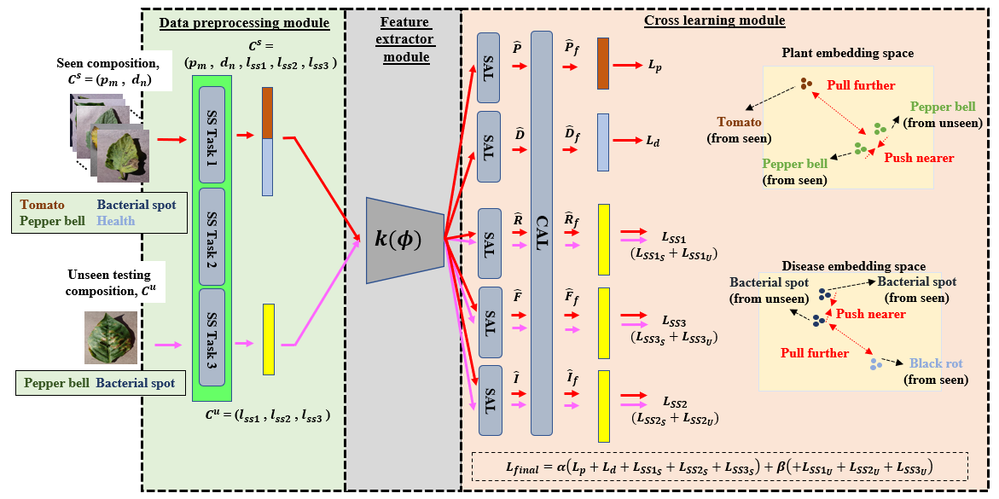
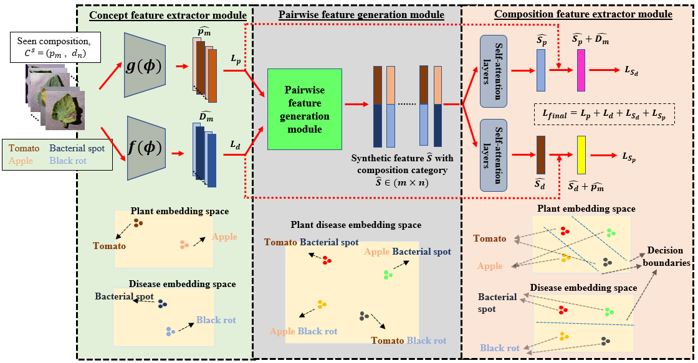
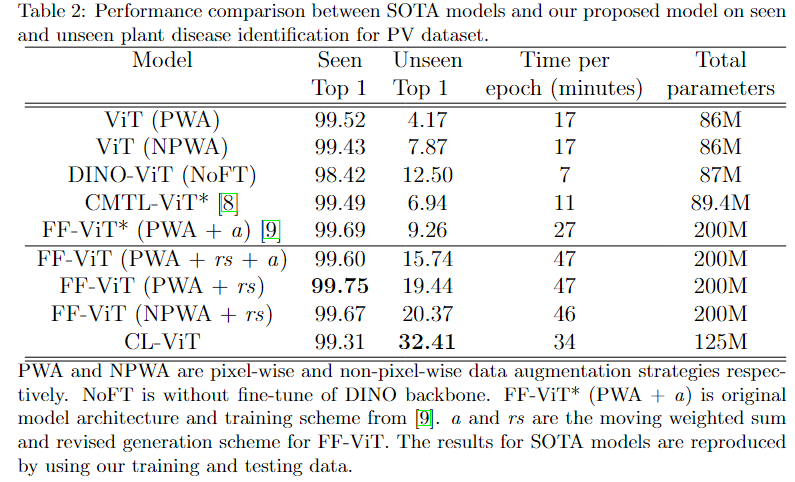

# Beyond-supervision-Harnessing-self-supervised-learning-in-unseen-plant-disease-recognition

## Introduction
This is a pytorch implementation for CL-ViT and FF-ViT in [Beyond supervision: Harnessing self-supervised learning in unseen plant disease recognition](https://www.sciencedirect.com/science/article/pii/S0925231224013791)


<p align="center">Proposed CL-ViT architecture.</p>



<p align="center">Proposed FF-ViT architecture.</p>

The contributions of this paper:
1. We demonstrate that the incorporation of a guided learning mechanism surpasses conventional approaches in the multi-plant disease identification benchmark. Furthermore, we show that the CL-ViT model, integrating a SSL approach, outperforms the FF-ViT model employing a purely supervisory learning scheme for unseen plant disease identification tasks.
2. In our qualitative analyses, we illustrate that CL-ViT learns a feature space capable of discriminating between different classes while minimizing the domain gap between seen and unseen data. This underscores the superiority of CL-ViT in implementing a more effective guided learning mechanism.

## Results

## Preparation

* Dataset: [spMohanty Github](https://github.com/spMohanty/PlantVillage-Dataset/tree/master)  
(You can group all images into single folder to directly use the csv file provided in this repo)

* download [ViT pretrained weight](https://github.com/rwightman/pytorch-image-models/releases/download/v0.1-vitjx/jx_vit_base_p16_224-80ecf9dd.pth) link (From [rwightman Github timm repo](https://github.com/huggingface/pytorch-image-models))
## Implementations
CL-ViT >> [code](model/CL-ViT.py)

Notes
* The csv file (metadata of images) are [here](dataset/csv_CLViT/)


FF-ViT >> [code](model/FF-ViT.py)

Notes
* The csv file (metadata of images) are [here](dataset/csv_FFViT/)  
(path_list.csv to locate the csv.file for all crop and disease training classes)
## See also
1. [Pairwise Feature Learning for Unseen Plant Disease Recognition](https://ieeexplore.ieee.org/abstract/document/10222401/): The first implementation of FF-ViT model with moving weighted sum. The current work improved and evaluated the performance of FF-ViT model on larger-scale dataset.
2. [Unveiling Robust Feature Spaces: Image vs. Embedding-Oriented Approaches for Plant Disease Identification](https://ieeexplore.ieee.org/abstract/document/10317550/): The analysis between image or embedding feature space for plant disease identifications.

## Dependencies
Pandas == 1.4.1  
Numpy == 1.22.2  
torch == 1.10.2  
timm == 0.5.4  
tqdm == 4.62.3  
torchvision == 0.11.3  
albumentations == 1.1.0  

## License

Creative Commons Attribution-Noncommercial-NoDerivative Works 4.0 International License (“the [CC BY-NC-ND License](https://creativecommons.org/licenses/by-nc-nd/4.0/)”)

## Citation

```bibtex
@article{chai2024beyond,
  title={Beyond supervision: Harnessing self-supervised learning in unseen plant disease recognition},
  author={Chai, Abel Yu Hao and Lee, Sue Han and Tay, Fei Siang and Bonnet, Pierre and Joly, Alexis},
  journal={Neurocomputing},
  pages={128608},
  year={2024},
  publisher={Elsevier}
}
