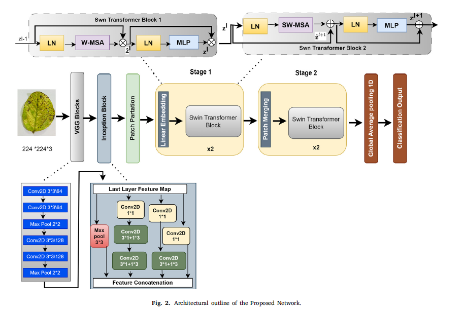

# SoyaTrans

## Architecture  
  
The SoyaTrans model takes an input image of 224 × 224. This image is passed into the VGG16 network two convolution blocks with each block containing convolution layers, and max pooling layer resulting in the 56 × 56 × 128 output. This output is further fed into the Inception v7 Conv block containing a multilevel feature extraction block. The multi-level feature extraction block improves the learnability of local features of the model and generates an output of size 56 × 56 × 512 after concatenating the feature maps generated by different Convolution layers. Further, the feature map undergoes a transformation into non-overlapping patches through the patch partition module. Here, patches are represented as tokens, and features are concatenations of RGB pixels. In the proposed network patch size is taken as 4 × 4, and the dimension of features in each patch is 4 × 4 × 3 = 48. In addition, this is fed into a stack of two swin transformer blocks for feature extraction. In the first block, a linear embedding layer is enforced on the raw-valued feature which projects to an arbitrary dimension value denoted as C (embedding dimension). Further, these are passed through, two successive swin transformer blocks incorporating W-MSA and SW-MSA. Here, the first block i.e. Window based multiheaded self-attention uses a regular window partitioning strategy. The second swin transformer block contains Shifted window-based multiheaded self-attention for better interaction with other windows. Further masking is performed to each sub-area because non-adjacent sub-areas do not exchange information during self-attention is denoted as stage 1. In stage 2, the patch merging layer is enforced to reduce the no of tokens as the network goes deeper which transforms the features, in addition to the swin transformer block of stage 1 capturing the long-term dependencies. Lastly, the global average pooling layer is incorporated which converts the final output of the Swin transformer block into a 1-D dimensional vector. Here softmax activation function is used as the dataset contains multiple classes. The pseudo-code of the proposed SoyaNet is depicted in 1.  

| Type of Layer | Output Vector | Configurations |
| --- | --- | --- |
| Input Layer | (None, 224, 224, 3) | Image |
| VGG Block | (None, 56, 56, 128) | Conv2D (3 × 3) (stride-1), BN, ReLU, MaxPooling2D (2 × 2) (stride-2) |
| Inception Block | (None, 56, 56, 512) | Conv2D (diff-diff kernel size and stride), BN, ReLU, MaxPooling2D(2 × 2) (stride-1) |
| Stage 1 | (None, 14, 14, 512) | Conv2D (4 × 4) (stride-4), LayerNormalisation, W-MSA, MLP, Proposedshifting-MSA |
| Stage 2 | (None, 7, 7, 512) | LayerNormalisation, W-MSA, MLP, Proposedshifting-MSA |
| Classification | (None, 6) | LayerNormalisation, AvgPooling, Linear |

## Hyperparameters

In this study, grid search technique is applied which find the best hyperparameters set from the search space of probability range from 0.3 to 0.7, and learning rate range from 0.0001 to 0.1. Furthermore, different optimizers SGD (Stochastic Gradient Descent), Rmsprop (Root Mean Square Propagation), and Ada-grad has been applied. Furthermore, the results demonstrates that the different optimal parameters were taken into the account. To improve the efficacy of the model, batch size ‘32’ is selected. This is due to the fact that increased batch size affects classification accuracy resulting in the decrement of learning rate. As the number of epochs increases, the training curve gradually converges towards the optimal state, reaching a point of potential overfitting by the 50th epoch. Hence, we set the number of epochs at 50, maintaining a fixed learning rate of 0.0001, and automatic model saving during training. In addition to this, models are trained on different learning rate, which deteriorated the model performance. To improve the effectiveness of the model different optimizer were tested such as SGD, RmsProp, and Adam. The Adam optimizer outperforms on better in different datasets. Therefore, Adam optimizer is chosen, by its ability to handle nonstationary targets and sparse gradients. Moreover, there is a dynamic adjustment in the learning rate during model training and shown their better convergence at 0.0001. Additionally, sparse categorical crossentropy is employed for the classification of multiple classes. Besides, this dropout rate is applied in every dropout layer with probability values ranging from 0.3 to 0.7. To mitigate over-fitting and enhance model performance, a dropout rate of 0.5 is chosen. Conclusively, Leaky Relu activation function followed by batch norm is applied after each layer. The integration of these techniques results in improved classification. During the evolution of the model, various combinations are explored to determine the optimal selection. Further, Sparse categorical cross-entropy is applied for classifying the multiple class.

| Hyperparameter         | Search Space                            | Optimal Parameter               |
|------------------------|----------------------------------------|--------------------------------|
| **Learning Rate**      | [0.0001, 0.001, 0.01, 0.1]             | 0.0001                         |
| **Optimizer**         | [SGD, RmsProp, Adam, Ada-grad]         | Ada-grad                       |
| **Batch Size**        | [32, 64]                               | 32                             |
| **Dropout Rate**      | [0.3, 0.4, 0.5, 0.6, 0.7]              | 0.5                            |
| **Image Size**        | 224 × 224                              | 224 × 224                      |
| **Activation Function** | [ReLU, Leaky ReLU]                     | Leaky ReLU                     |
| **Loss Function**     | Label smoothing                        | Label smoothing cross entropy  |

## Dataset

In this study, the soybean leaf dataset comprises a of total 2890
raw images.Finally, we were left with 2500 images ready. At the outset, the captured images have dimensions of 4000 × 3000 × 3 pixels. Handling these size images is extremely difficult and necessitates a properly geared computing facility. Furthermore, an initial step involves cropping certain sections of the image backgrounds, resulting in images of size 3000 × 3000 × 3 pixels. Subsequently, the images are resized to dimensions of 224 × 224 × 3 pixels.

## Dataset Expansion

In this section dataset expansion, partitioning is performed on the images after scaling which is of size 224 × 224. Besides this, to obtain a single leaf, a region calibration method is applied. In addition, after applying these data augmentation techniques the overall image count is 4829 of six different leaf classes. Table 4 and 5 illustrates the different image datasets. Furthermore, it is also evident from the table that the soybean dataset is imbalanced which affects the classification performance and results in an over-fitting problem. To overcome these challenges, different augmentation techniques such as flipping, zoom, rotation, and translation have been applied to balance the dataset. Furthermore, to access the model generalization capabilities i.e the model performance on unseen datasets the data set is divided into the ratio of 80% in training samples, 20% testing sample, and 70% in training samples, 30% testing samples and depicted in Tables 6 and 7.

[Claude](https://claude.ai/chat/09d2b330-6155-4449-abf2-c3bc5083f798)
